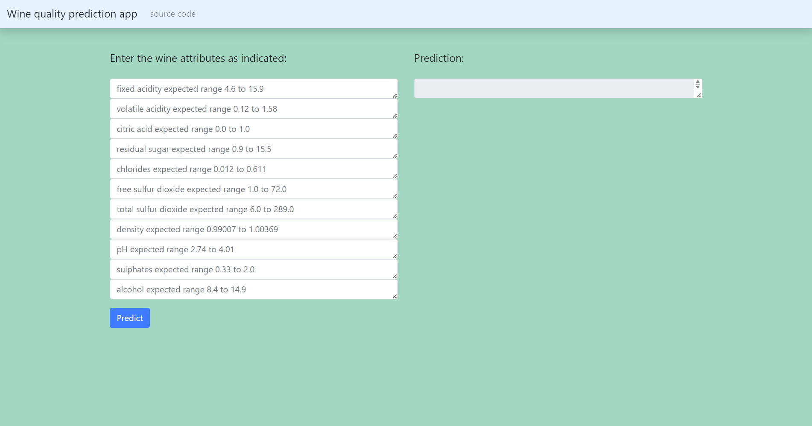

# End-to-end-wine_quality_prediction

This repository contains an end-to-end project for predicting wine quality using machine learning. The main objectives are to run Machine Learning pipelines and deploy the application for predicting wine quality. It also includes automated testing and continuous integration for robust development.

## Setup, train, evaluate and test 
### Run locally
Clone the project:

```bash
 git clone https://github.com/DimitrisReppas/End-to-end-wine_quality_prediction.git
```

Create and activate an environment: 

```bash
conda create -n your_env_name python=3.7 -y
```

```bash
conda activate your_env_name
```

Install the requirements for this project:

```bash
pip install -r requirements.txt
```

### Dataset

The dataset we use can be found [here](https://drive.google.com/drive/folders/18zqQiCJVgF7uzXgfbIJ-04zgz1ItNfF5?usp=sharing).

Download it and put it into the data_given/ directory.

### Initialize Git and DVC and track data

```bash
git init
```
```bash
dvc init 
```
```bash
dvc add data_given/winequality.csv
```
### Start MLflow tracking server

Execute the following command in a new terminal window:
```bash
mlflow server --backend-store-uri sqlite:///mlflow.db --default-artifact-root ./artifacts --host 0.0.0.0 -p 1234
```
Navigate to the MLflow UI at http://localhost:1234/

### Run the DVC Pipeline

The pipeline includes the following stages:
1) data loading
2) data splitting
3) model training
4) model evaluation on the test set
5) automatically choosing the best model from the mlflow.db

Run the DVC Pipeline:
```bash
dvc repro
```
### Run Tests
These tests ensure that the code handles different scenarios correctly:
- Producing valid results for correct input ranges.
- Raising appropriate exceptions or returning error messages for out-of-range inputs and incorrect column names.
Run the tests:
```bash
pytest -v
```
### Automatic testing

Each time you perform a push or pull request, automatic testing of your code is triggered using the ci_cd.yaml in the .github/workflows directory.


## Run the Wine Quality application



### Running the app and the inference model


```bash
python app.py 
```

### Set up and run the app with Docker

The Docker container is configured to handle POST requests.

1) open Docker Desktop application 

2) Build the Docker container:
```bash
docker-compose build
```

3) Run the Docker container:
```bash
docker-compose up -d
```

4) Open your preferred browser and navigate to http://127.0.0.1:5000/ to start using the application.

## Acknowledgement

This repository is inspired and based on https://github.com/c17hawke/simple-dvc-demo and on https://www.youtube.com/playlist?list=PLZoTAELRMXVOk1pRcOCaG5xtXxgMalpIe

